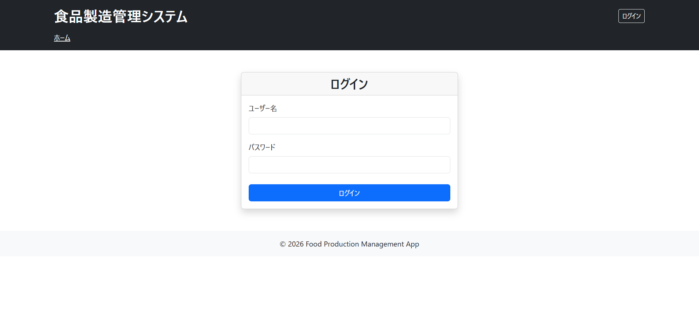
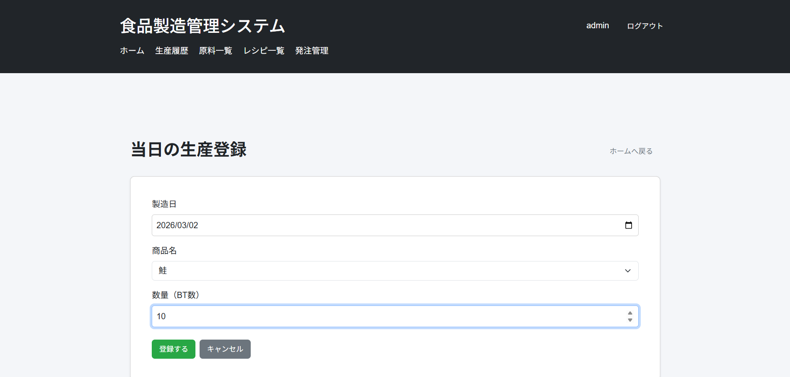
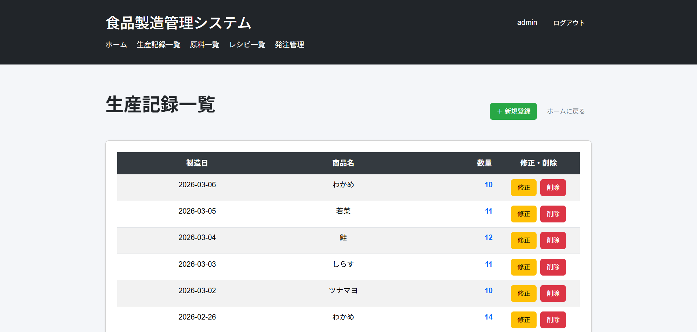
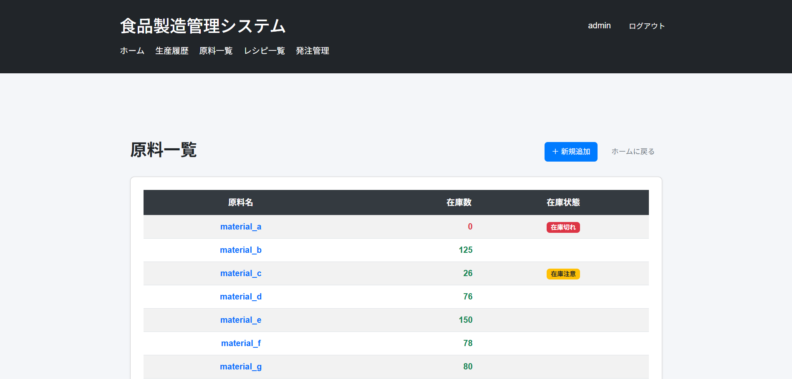
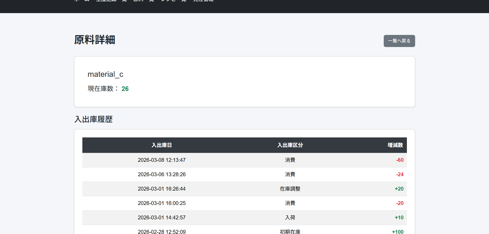
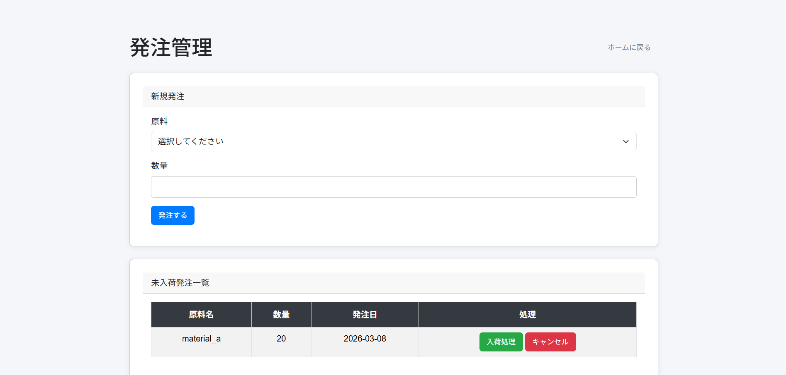
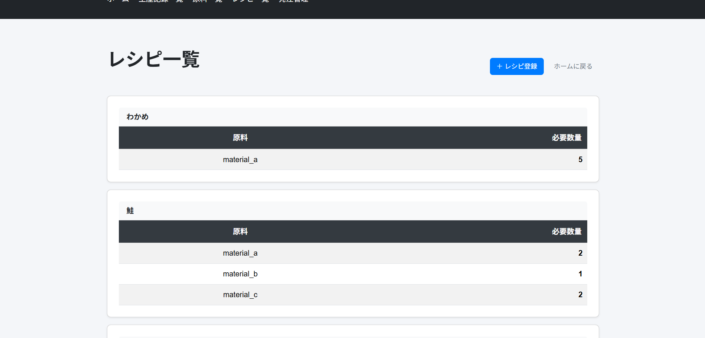
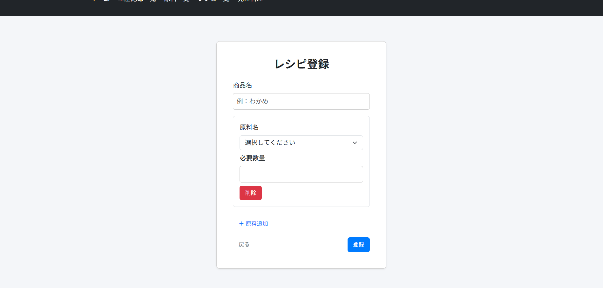
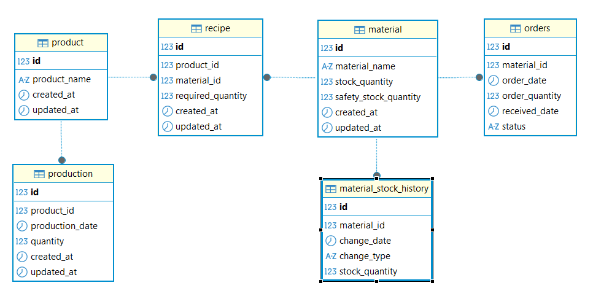

# 食品製造管理アプリ

## 概要
食品製造現場の実務を想定した在庫・生産管理アプリケーションです。

当日の生産登録を行うと、レシピに基づき、原料在庫が自動で減少し、生産履歴・在庫履歴としてデータベースに記録されます。

また、原料発注を行うことで、入荷処理によって在庫を補充することができます。

ユーザー権限（USER / ADMIN）による機能制御も実装しています。

---

## 開発目的
①職業訓練で学習した技術、知識を活かして一つのアプリケーションを形にすること

②業務フローを意識し、実際に必要とされ、使用すると便利だと思えるようなものをつくること 

以上の二点を意識して取り組みました。②に関して、以前勤めていた職場での当日の生産の記録や、原料の在庫管理の経験から、あったら便利だと感じていた在庫・生産管理システムを題材としました。 

---

## 使用技術

### バックエンド
- Java 17
- Spring Boot 3
- Spring MVC
- Spring Data JPA
- Spring Security

### フロントエンド
- HTML
- Thymeleaf
- Bootstrap 5

### データベース
- MySQL
- JPA / Hibernate

### 開発環境
- Eclipse
- DBeaver
- Git
- GitHub

### その他
- Gradle
- Lombok
- Thymeleaf Layout Dialect
- Thymeleaf Spring Security Extras

---

## ユーザー権限

| 機能 | USER | ADMIN |
|------|------|-------|
| 生産記録の登録 | ○ | ○ |
| 生産履歴の確認・修正 | ○ | ○ |
| 原料在庫の確認 | ○ | ○ |
| レシピ一覧の閲覧 | ○ | ○ |
| 原料の発注 | × | ○ |
| レシピの登録 | × | ○ |
| レシピの削除 | × | ○ |
| 原料の登録 | × | ○ |

---

## デモアカウント

USER  
username: user  
password: password  

ADMIN  
username: admin  
password: password

---

## 主な機能

### ① ログイン機能

Spring Securityを利用したログイン機能を実装しています。  
ユーザー権限（USER / ADMIN）によって利用できる機能を制御しています。

### ② 生産登録

製品・製造日・数量を入力して生産登録を行います。  
登録時にはレシピを参照し、使用原料量に基づいて原料在庫が自動で減少します。  
また、在庫変動は在庫履歴として記録されます。

---

### ③ 生産履歴管理

登録された生産記録を一覧で確認できます。  
製造日順（新しい順）に並び替えて表示しています。
また、生産記録の修正や削除を行うこともできます。

---

### ④ 原料在庫管理

原料ごとの現在在庫数を一覧で確認できます。  
在庫不足時には発注を行うことができます。

---

### ⑤ 在庫履歴確認

原料の在庫増減履歴を確認できます。  
生産による在庫減少や、入荷による在庫増加を履歴として記録しています。

---

### ⑥ 発注管理（管理者機能）

管理者ユーザーは原料の発注登録と入荷処理を行うことができます。  
入荷処理を行うことで在庫が自動で更新されます。

---

### ⑦ レシピ一覧

登録されているレシピを一覧で確認できます。  
製品ごとに使用する原料と使用量を確認することができます。

---

### ⑧ レシピ登録（管理者機能）

管理者ユーザーはレシピの新規登録を行うことができます。  
製品ごとに使用する原料と使用量を設定できます。
原料は複数設定することもできます。

---

## 開発する上で工夫した点
①職業訓練ではJava、MySQL、HTMLの基礎技術と、EclipseやDBeaverなどの開発ツールの使い方を学習し、それらの知識を活かしながら、個人学習としてSpring BootやSpring Data JPAを調べながら開発を進めることで、学習内容の理解を深めることを意識しました。

②原料在庫の増減を履歴として確認できるように、在庫履歴テーブルを作成しました。生産による在庫減少や入荷による在庫増加を履歴として記録することで、在庫の変動を後から確認できるようにしています。

③Spring Securityを利用し、USERとADMINのロールによる権限制御を実装しました。
管理者のみが発注管理や原料登録などを行えるようにすることで、実際の業務システムを意識した設計にしています。

---

## 今後の改善点や追加したい機能

①生産履歴や在庫履歴はデータ件数が増えると
画面表示や読み込み速度に影響する可能性も考えられるので、ページネーション機能を実装することで
大量データでも見やすく扱えるよう改善したいと考えています。

②現在は手動で動作確認を行いながら開発していますが、
今後はテストコードを追加し、在庫減少処理や入荷処理などの
処理が正しく動作することを確認できるようにしたいと考えています。

③現在も基本的な入力チェックは行っていますが、
より安全にデータを扱えるようバリデーションを強化したいと考えています。

④現在、Bootstrapを使用した基本的なUIを実装していますが、実際の業務で使用されるようなUIやUXを意識して、操作性の向上を検討しています。

⑤原料詳細画面の入出庫履歴に、変動後の在庫数の表示の追加をしたいと考えています。

---

## ER図

## 作成者

山本優斗
